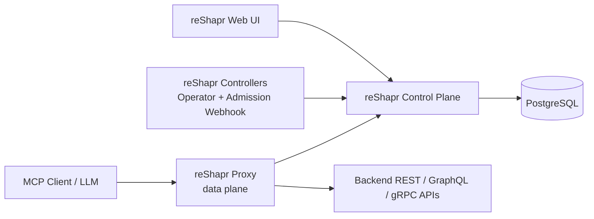

# reShapr Helm Charts

Helm Charts for installing reShapr components on Kubernetes

[](https://github.com/reshaprio/reshapr-helm-charts/actions)
[](https://quay.io/repository/reshapr/reshapr-helm-charts/reshapr-control-plane?tab=tags)
[](https://kubernetes.io/)
[](https://www.apache.org/licenses/LICENSE-2.0)
[](https://discord.gg/KyDUdam34h)
[](https://github.com/reshaprio/reshapr-helm-charts)

## Build Status

Latest released version is `0.0.10`.

Current development version is `0.0.11`.

## Table of Contents

- [Overview](#overview)
- [Prerequisites](#prerequisites)
- [How to use them?](#how-to-use-them)
  - [reShapr control plane](#reshapr-control-plane)
  - [reShapr proxy](#reshapr-proxy)
  - [reShapr UI](#reshapr-ui)
  - [reShapr controllers](#reshapr-controllers)
- [Verifying chart signatures](#verifying-chart-signatures)
- [Upgrading](#upgrading)
- [Uninstalling](#uninstalling)

## Overview

These charts install the runtime components of [reShapr](https://github.com/reshaprio/reshapr), a
no-code MCP (Model Context Protocol) server that turns REST/GraphQL/gRPC APIs into LLM-friendly
tools. Each component ships as its own chart so you can install only what you need.



**Namespace topology.** The control plane, the web UI and the controllers are installed in the
`reshapr-system` namespace. Proxies are typically deployed in a dedicated `reshapr-proxies`
namespace (a proxy can also be injected as a sidecar by the admission webhook into any
application namespace). Keep this in mind when wiring the `gateway.controlPlane.host` value of
the proxy chart to the control plane Service.

## Prerequisites

- Kubernetes ≥ 1.25
- Helm ≥ 3.8 (OCI support is enabled by default since Helm 3.8)
- Cluster-admin privileges to install CRDs and cluster-scoped RBAC
- [cert-manager](https://cert-manager.io/) — required by the web UI when TLS is enabled and by
  the controllers chart when using the default cert-manager certificate provider

## How to use them?

This repository contains four Helm charts:

* The `reshapr-control-plane` Helm chart is dedicated to the installation of the reShapr control plane. It is distributed as an OCI artifact on https://quay.io/repository/reshapr/reshapr-helm-charts/reshapr-control-plane — see its [chart README](./control-plane/README.md) and [commands](./control-plane/COMMANDS.md).

* The `reshapr-proxy` Helm chart is dedicated to the installation of the reShapr proxy. It is distributed as an OCI artifact on https://quay.io/repository/reshapr/reshapr-helm-charts/reshapr-proxy — see its [chart README](./proxy/README.md) and [commands](./proxy/COMMANDS.md).

* The `reshapr-web-ui` Helm chart is dedicated to the installation of the reShapr control UI. It is distributed as an OCI artifact on https://quay.io/repository/reshapr/reshapr-helm-charts/reshapr-web-ui — see its [chart README](./web-ui/README.md) and [commands](./web-ui/COMMANDS.md).

* The `reshapr-controllers` Helm chart is dedicated to the installation of the reShapr Kubernetes controllers (operator & admission webhook). It is distributed as an OCI artifact on https://quay.io/repository/reshapr/reshapr-helm-charts/reshapr-controllers — see its [chart README](./controllers/README.md) and [commands](./controllers/COMMANDS.md).

> [!WARNING]
> The `--set` examples below use demo credentials for readability. **Do not use them as-is in
> production.** Secrets passed via `--set` end up in your shell history and in the Helm release
> metadata — prefer a values file (`-f my-values.yaml`), `--set-file`, or reference pre-created
> Kubernetes Secrets (see each chart's README).

> [!NOTE]
> `helm pull` is optional — installing directly from an `oci://` reference downloads the chart
> automatically. Use `helm pull` only to inspect a chart locally before installing it.

### reShapr control plane

```sh
helm pull oci://quay.io/reshapr/reshapr-helm-charts/reshapr-control-plane --version 0.0.10

helm install reshapr-control-plane oci://quay.io/reshapr/reshapr-helm-charts/reshapr-control-plane --version 0.0.10 \
  --create-namespace --namespace reshapr-system \
  --set postgresql.enabled=true \
  --set postgresql.auth.password=admin \
  --set apiKey.value=dev-api-key-change-me-in-production \
  --set encryptionKey.value=dev-encryption-key-change-4-prod \
  --set admin.nameValue=admin \
  --set admin.passwordValue=password \
  --set admin.emailValue=reshapr@example.com \
  --set admin.defaultGatewayTokensValue=my-super-secret-token-xyz \
  --set ingress.enabled=true \
  --set ingress.ctrl.host=reshapr.acme.loc
``` 

### reShapr proxy

```sh
helm pull oci://quay.io/reshapr/reshapr-helm-charts/reshapr-proxy --version 0.0.10

helm install reshapr-proxy oci://quay.io/reshapr/reshapr-helm-charts/reshapr-proxy --version 0.0.10 \
  --create-namespace --namespace reshapr-proxies \
  --set gateway.idPrefix=acme \
  --set gateway.labels='env=dev;team=reshapr' \
  --set gateway.fqdns=mcp.acme.loc \
  --set ingress.enabled=true \
  --set 'ingress.hosts[0].host=mcp.acme.loc' \
  --set gateway.controlPlane.host=reshapr-control-plane-ctrl.reshapr-system \
  --set gateway.controlPlane.port=5555 \
  --set gateway.controlPlane.token=reshapr-my-super-secret-token-xyz
```

### reShapr UI

For this one, a TLS ingress is mandatory if you choose to enable TLS. We're using a CertManager ClusterIssuer in example below:

```sh
helm pull oci://quay.io/reshapr/reshapr-helm-charts/reshapr-web-ui --version 0.0.10

helm install reshapr-ui oci://quay.io/reshapr/reshapr-helm-charts/reshapr-web-ui --version 0.0.10 \
  --namespace reshapr-system \
  --create-namespace \
  --set apiKey.value=dev-api-key-change-me-in-production \
  --set publicUrl=https://reshapr-ui.acme.loc \
  --set ingress.enabled=true \
  --set ingress.annotations."cert\-manager\.io\/cluster\-issuer"=cert-cluster-issuer \
  --set 'ingress.hosts[0].host=reshapr-ui.acme.loc' \
  --set 'ingress.tls[0].hosts[0]=reshapr-ui.acme.loc' \
  --set 'ingress.tls[0].secretName=reshapr-web-ui-tls'
```


This `reshapr-web-ui` is also included as a dependency in the control plane chart. As a consequence, you can install it directly with the control plane in a single command:

```bash
helm pull oci://quay.io/reshapr/reshapr-helm-charts/reshapr-control-plane --version 0.0.10

helm install reshapr-control-plane oci://quay.io/reshapr/reshapr-helm-charts/reshapr-control-plane --version 0.0.10 \
  --create-namespace --namespace reshapr-system \
  --set postgresql.enabled=true \
  --set postgresql.auth.password=admin \
  --set apiKey.value=dev-api-key-change-me-in-production \
  --set encryptionKey.value=dev-encryption-key-change-me-in-production \
  --set admin.nameValue=admin \
  --set admin.passwordValue=password \
  --set admin.emailValue=reshapr@example.com \
  --set admin.defaultGatewayTokensValue=my-super-secret-token-xyz \
  --set ingress.enabled=true \
  --set ingress.ctrl.host=reshapr.acme.loc \
  --set reshapr-web-ui.enabled=true \
  --set reshapr-web-ui.publicUrl=https://reshapr-ui.acme.loc \
  --set reshapr-web-ui.ingress.enabled=true \
  --set reshapr-web-ui.ingress.annotations."cert\-manager\.io\/cluster\-issuer"=cert-cluster-issuer \
  --set 'reshapr-web-ui.ingress.hosts[0].host=reshapr-ui.acme.loc' \
  --set 'reshapr-web-ui.ingress.tls[0].hosts[0]=reshapr-ui.acme.loc' \
  --set 'reshapr-web-ui.ingress.tls[0].secretName=reshapr-web-ui-tls'
```

### reShapr controllers

The `reshapr-controllers` chart deploys the reShapr Kubernetes **operator** and **admission webhook**. Both components are enabled by default; you can install only one with `--set admissionController.enabled=false` or `--set operator.enabled=false`.

The admission webhook needs a serving TLS certificate. By default it relies on [cert-manager](https://cert-manager.io/) (must be installed in the cluster); alternative providers (`openshift`, `existing`) are documented in the [controllers chart README](./controllers/README.md#tls-for-the-admission-controller).

```sh
helm pull oci://quay.io/reshapr/reshapr-helm-charts/reshapr-controllers --version 0.0.11

helm install reshapr-controllers oci://quay.io/reshapr/reshapr-helm-charts/reshapr-controllers --version 0.0.11 \
  --create-namespace --namespace reshapr-system
```

Once installed, register the operator ServiceAccount as a trusted client on the control plane so it can authenticate (see the [controllers chart README](./controllers/README.md#operator)):

```sh
export RESHAPR_ADMIN_API_KEY='<admin-api-key>'

reshapr admin --server https://reshapr.acme.loc \
  service-account create reshapr-system-operator \
  --k8s-subject reshapr-system:reshapr-controllers-operator \
  --allowed-organizations '["*"]' \
  --validity-days 90
```

## Verifying chart signatures

Every chart is signed with [cosign](https://docs.sigstore.dev/) (keyless, via GitHub Actions OIDC)
during the release. You can verify a chart before installing it:

```sh
cosign verify \
  --certificate-identity-regexp 'https://github.com/reshaprio/reshapr-helm-charts/.+' \
  --certificate-oidc-issuer https://token.actions.githubusercontent.com \
  quay.io/reshapr/reshapr-helm-charts/reshapr-control-plane:0.0.10
```

Replace the chart name and tag to verify the `reshapr-proxy`, `reshapr-web-ui` or
`reshapr-controllers` artifacts.

## Upgrading

```sh
helm upgrade <release> oci://quay.io/reshapr/reshapr-helm-charts/<chart> --version <version> \
  --namespace <namespace> --reuse-values
```

For example, to upgrade the control plane:

```sh
helm upgrade reshapr-control-plane oci://quay.io/reshapr/reshapr-helm-charts/reshapr-control-plane \
  --version 0.0.11 --namespace reshapr-system --reuse-values
```

## Uninstalling

```sh
helm uninstall <release> --namespace <namespace>
```

> [!WARNING]
> Uninstalling the `reshapr-controllers` chart does **not** remove its CRDs (Helm never deletes
> CRDs). Deleting them removes every reShapr custom resource across all namespaces, so do it only
> when you really intend to:
>
> ```sh
> kubectl delete crd $(kubectl get crd -o name | grep reshapr.io)
> ```